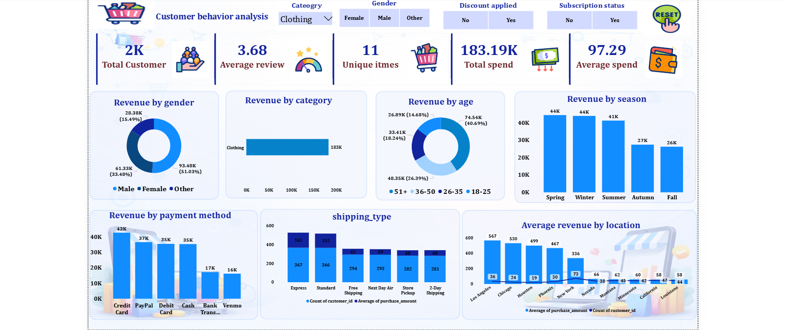
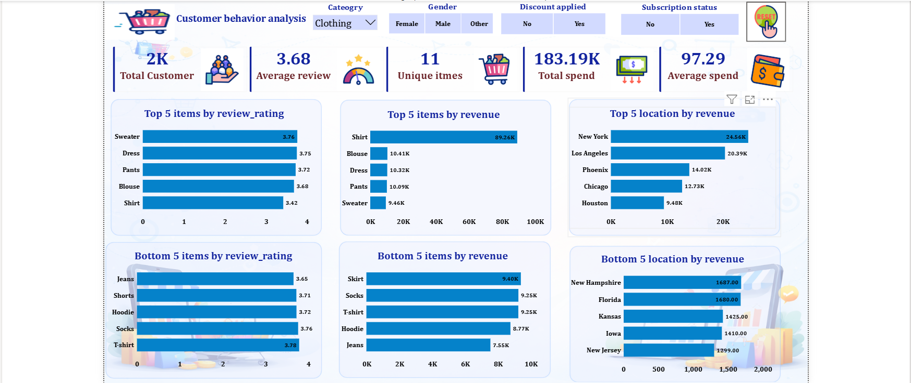

# Customer Shopping Behavior Analysis

## Overview
This Data Analytics project analyzes customer shopping behavior, purchasing trends, and demographic insights using Python, SQL, and Power BI. The objective is to identify customer preferences and support data-driven business decisions.

## Technologies Used
- Python
- SQL
- Power BI
- Pandas
- NumPy
- Matplotlib
- Seaborn

## Key Features
- Customer Segmentation Analysis
- Purchase Trend Analysis
- Demographic Insights
- Interactive Power BI Dashboard
- Data Cleaning and Exploratory Data Analysis (EDA)

## Project Files
- `behavior.ipynb` – Data Analysis Notebook
- `behavior.sql` – SQL Queries
- `Customer behavior.pbix` – Power BI Dashboard
- `customer_shopping_behavior.csv` – Dataset

## Key Insights
- Identified customer purchasing patterns
- Analyzed demographic behavior trends
- Evaluated customer spending habits
- Generated insights for business decision-making

## Dashboard Screenshots

### Customer Shopping Dashboard

### Customer Insights Dashboard

